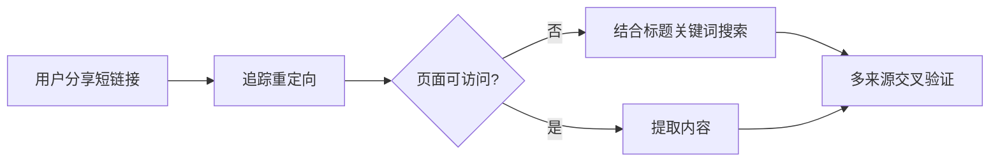

# 死链/短链接内容恢复技术

当用户分享的社交媒体链接失效（404）或内容为图片时，使用本流程恢复内容。

## 触发场景

- 小红书/抖音短链接（xhslink.com、douyin.com 等）返回 404
- 内容为纯图片，无法直接提取文字
- 原帖已删除但内容在网络上被多次转载

## 恢复流程

### 阶段一：确定原始内容



#### 1.1 追踪短链接重定向
```bash
# 获取最终跳转URL
curl -sL -o /dev/null -w "%{url_effective}" "http://xhslink.com/o/5HatZOxFQMg"
# 或查看所有跳转
curl -sIL "http://xhslink.com/o/5HatZOxFQMg"
```

#### 1.2 尝试直接提取
```python
web_extract(urls=["最终URL"])
web_extract(urls=["短链接"])  # 有些会自动跳转
```

#### 1.3 页面404时的应对
如果返回404，说明原帖被删。此时切入**搜索阶段**。

### 阶段二：多来源搜索

使用精确搜索锁定相关内容：

```python
# 核心关键词 + 精确数字（如"21条"）
web_search(query="孙宇晨 21条 人生建议")
web_search(query='"孙宇晨" "21条" 建议')

# 按平台搜索可能存在的镜像
web_search(query="孙宇晨 20条 观点 site:xueqiu.com")
web_search(query="孙宇晨 建议 site:binance.com")

# 泛化搜索 - 去掉精确数字
web_search(query="孙宇晨 人生建议 财富自由")
```

**搜索技巧：**
- 先用精确短语（带引号）缩小范围
- 无结果时逐步放宽（去掉引号、去掉数字、换近义词）
- 尝试不同平台限制：`site:binance.com`、`site:xueqiu.com`、`site:zhuanlan.zhihu.com`
- 内容多到单页截断的页面用 `web_extract()` 获取全文

### 阶段三：交叉验证与重建

从多个来源提取片段后，需要进行验证和整合：

| 来源类型 | 信任度 | 用途 |
|---------|-------|------|
| 原帖截图/原文转载 | 高 | 核心内容来源 |
| 主流媒体引用 | 高 | 验证观点真实性 |
| 个人社交媒体复述 | 中 | 补充细节 |
| 币安广场/雪球等投资平台 | 中 | 通常有完整引述 |
| 广告营销式改写 | 低 | 仅参考结构，过滤广告植入 |

**整合原则：**
1. 优先采用多来源一致的内容
2. 标注来源说明（如"小红书原文已失效，此为多来源交叉汇编版本"）
3. 区分事实与二次解读
4. 保留争议/矛盾点（如孙宇晨自己前后说法不一致时，如实记录）

### 阶段四：保存到知识库

```bash
# 路径示例
/vol1/1000/HermesAgentProfile/assistant_knowledge/{topic-name}.md

# 文件结构建议
# # 标题 - 来源说明
# ## 一、经典部分（多来源验证的稳定内容）
# ## 二、其他来源补充（标明来源）
# ## 三、最新更新（时效性强）
# ## 应用说明（如何使用这份知识）
```

## 常见陷阱

### 陷阱1：被营销文误导
有些网站会"蹭热点"，用名人名言包装自己的项目推广。如 origin.pub 网站的"孙宇晨20条"实际是LGNS/ANUBIS项目的广告。**辨别方式**：看内容是否突然转向推荐特定项目/产品。

### 陷阱2：只找到部分内容就停止
"I found 8条" ≠ "内容只有8条"。很可能还有其他多条在不同来源中。持续搜索直到结果收敛。

### 陷阱3：直接复制低信任来源
币安广场/雪球的引述通常准确但可能有二次创作。交叉验证后再使用。

### 陷阱4：忽略短链接的时效性
小红书短链接（xhslink.com）常有有效期。用户发来的链接可能已过期，但**内容本身仍在网络上流传**。不要因为链接死了就放弃。

## 案例：孙宇晨21条恢复

```
用户来源: 小红书短链接 http://xhslink.com/o/5HatZOxFQMg
状态: 404（页面已删除）
最终来源: 新浪新闻 × 雪球 × 币安广场 × X/Twitter × 澳纽网
重建内容: 30条核心观点（六大板块）
保存路径: assistant_knowledge/sun-yuchen-life-advice.md
重建时间: ~6次搜索 + 4次提取
```
